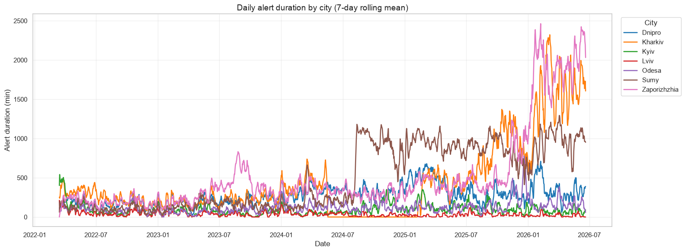
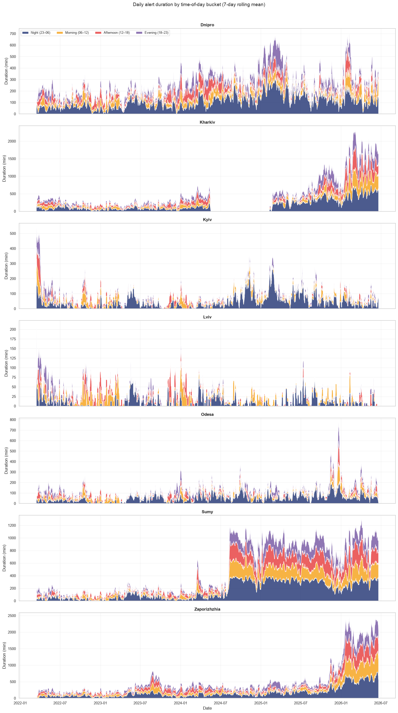
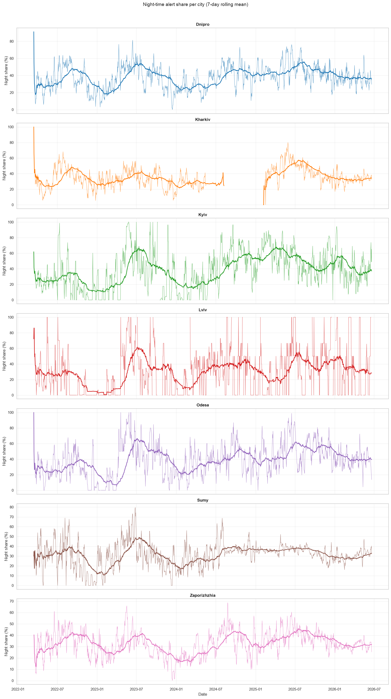
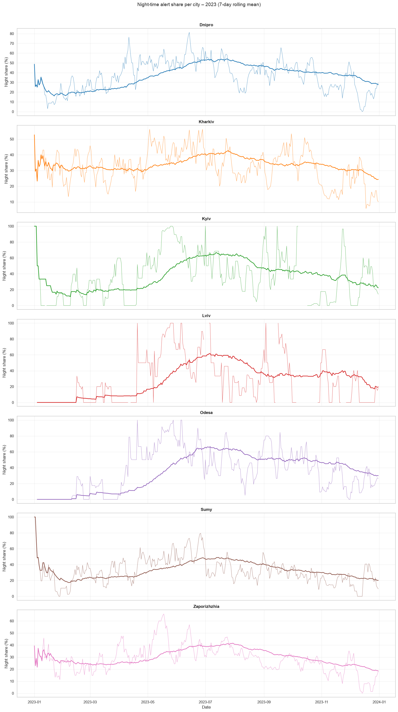
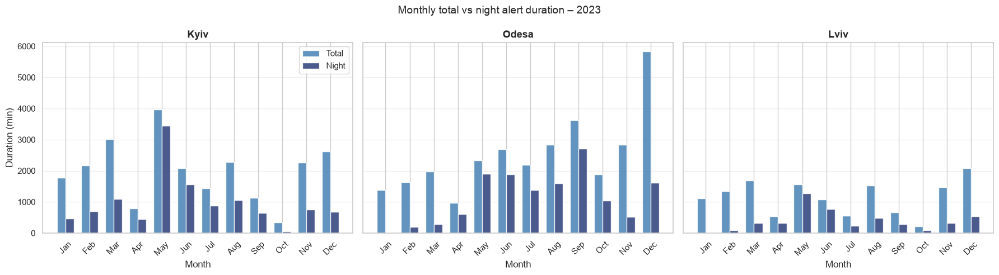
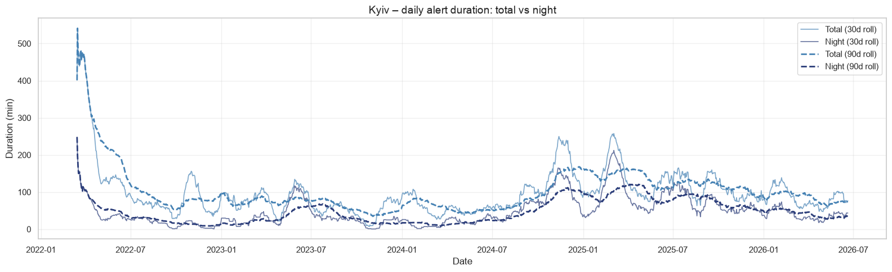
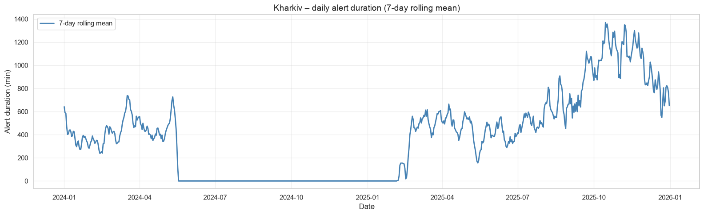

# Ukraine Air Alert Analysis

Dislaimer: this is only general overview quickly created by Claude, for further details see  and 

Analysis of 36,882 air alert events across seven Ukrainian cities from March 2022 through June 2026. The primary metric is **total alert duration per day** — a better proxy for threat intensity than raw alert count, since a single long strike matters more than several brief notifications. Each day's duration is split into four time windows: night (23:00–06:00), morning (06:00–12:00), afternoon (12:00–18:00), and evening (18:00–23:00).

> **Note:** Alert duration reflects when air alert systems were active, not the duration of attacks themselves. Kharkiv data contains a gap from May 2024 to February 2025 due to a data quality issue and should be interpreted with caution for that period.

---

## Cities

Seven cities were selected to represent distinct geographic and strategic roles:

| City | Role |
|---|---|
| Kyiv | Capital, symbolic long-range target |
| Kharkiv | 2nd largest city, ~30km from Russian border |
| Sumy | Northeast, directly on Russian border |
| Zaporizhzhia | South, adjacent to occupied territory |
| Dnipro | Strategic industrial rear hub |
| Odesa | South, Black Sea coast |
| Lviv | Western rear, lowest-threat baseline |

---

## Overall Picture

Two groups emerge clearly. **Frontline cities** (Kharkiv, Sumy, Zaporizhzhia) show dramatic escalation from 2025 onward, with Zaporizhzhia and Sumy reaching over 2,000 and 1,200 minutes per day respectively by 2026. **Rear cities** (Kyiv, Odesa, Lviv) maintain lower, more stable levels throughout. Kyiv is the only city that was *more* affected in early 2022 than in any subsequent period — structurally opposite to every frontline city.

---

## Time-of-Day Breakdown

Frontline cities show all four time buckets growing proportionally — alerts occur around the clock with no preferred window. Rear cities show a disproportionately large night share (dark blue), consistent with long-range strikes timed to arrive under cover of darkness.

---

## Night Share Analysis

Kyiv leads all cities in night share across the full period (49% overall), followed by Odesa (44%) and Dnipro (40%). Frontline cities cluster around 30–35%. The gap between rear and frontline cities is consistent across all years and reflects a structural difference in how each group is targeted.

Night share has risen over time for rear cities — from around 20–25% in 2022 to 50–66% by 2025 — while frontline cities remain relatively flat. This suggests long-range strike tactics have become increasingly night-oriented over the course of the war.

### Mid-2023 Intensification

A synchronized rise in night share across Kyiv, Odesa, and Lviv is visible in mid-2023, peaking around June–July. Absolute night duration rose in parallel — this is not purely a denominator artifact. The pattern partially reverses by late 2023, suggesting a temporary campaign rather than a permanent shift. Night share then rises again through 2025 to its highest sustained levels, indicating a second and more durable intensification.

---

## Kyiv Deep-Dive

Throughout the post-stabilization period (mid-2022 to 2026), Kyiv's night alert duration tracks total duration at a **stable proportional gap**, indicating that night-time targeting of the capital is a persistent structural feature rather than an episodic campaign. Two exceptions stand out: the opening weeks of the invasion (March–April 2022), when disproportionately high daytime activity reflected the ground-adjacent threat to the capital, and the late 2024–early 2025 spike periods, where total duration briefly surged before reverting to the established ratio.

---

## Kharkiv Data Gap

A single erroneous record spanning 604 days was removed from the Kharkiv data, exposing a genuine gap from May 2024 to February 2025 with no valid records. Kharkiv is retained as a comparison instrument but its cumulative metrics understate true exposure. Outside the gap, Kharkiv shows the highest sustained daily durations of any city in the dataset, exceeding 1,300 minutes per day by late 2025.
